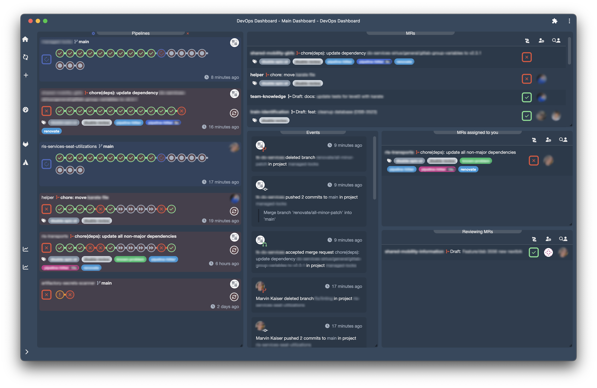

# DevOps Dashboard

The Dashboard is hosted with GitHub Pages and can be accessed at link:https://marvin-kaiser.dev/devops-dashboard/[marvin-kaiser.dev/devops-dashboard] 

A simple PWA - mostly for displaying GitLab Pipelines and Merge Requests

## Features

GitLab::
* **Display Pipelines for a group**. Filter by pipeline status and display either jobs by itself or just the stages.
* **Display Merge Requests** including assignee, reviewer, labels and the associated pipeline. Choose between MRs for a group, assigned to yourself or MRs you are reviewing.
* **Events for a group**. Gain a quick overview of what is happening in a group. Extra content like commit messages and comments are also displayed, including any markup and images. Events are clickable and open the corresponding URL in GitLab.
* **List Issues (WIP)**. Issue content like labels, description and due date can be edited. The issue description and any markup including images is rendered.

WhiteSource (Deprecated)::
WhiteSource (aka. Mend) support is deprecated and will be removed in the future

## Security

The Dashboard uses GitLabs link:https://docs.gitlab.com/ee/api/oauth2.html#authorization-code-with-proof-key-for-code-exchange-pkce[ Authorization code with Proof Key for Code Exchange (PKCE) flow]. The resulting access and refresh tokens are **not** persisted in the session storage or anything similar. To still enable a convenient usage of the dashboard while maintaining a high level of security, a service worker is utilized for handling the authentication. This service worker holds the tokens and signals the front end if re-authentication is needed.

For any user-content that is processed (e.g. Issue description), link:https://github.com/apostrophecms/sanitize-html[sanitize-html] is used.
